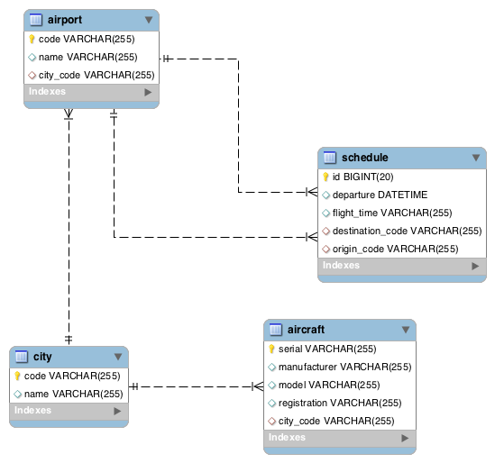

# AirFlux Capacity

## Note
The reason I asked to extend the time is that I wanted to understand the problem and the expectations.

As everything was based on my assumptions I read about airline business problems and algorithms.
what I found is a number of complex problems like Aircraft routing, aircraft assignment, crew assignment, 
gate assignment, tail assignment, ..etc, and number of candidate algorithms to solve these problems like Hungarian algorithm, 
graph max flow and graph shortest path.

As It is clear that I might complicate things too much by assumptions and it would take months to solve.
Since the expected time is 5-8 hours I assumed It is simple FIFO assignment problem.

## Assumptions
1. I assumed data are stored in DB, I used H2 in-memory DB to make it easy for you to set everything up,
I could've also parse data from files but I choosed to use LiquiBase to insert data in DB.

2. I assumed that each aircraft can fly anywhere.
3. I assumed there is a direct flight between all the airports and the flight duration is known, 
i used this assumption to position the aircraft to its hub.
4. I assumed that aircraft needs 1 hour (configured) to be ready to take off after arrival time.
5. I assumed this service will run only for the day 13 April 2018 but this could be easily changed by 
passing the date as parameter

## Solution
I designed the solution as a cron job that could plan the flights for next day, 
The idea is I did a simulation for the day flights, starting from the first flight, moving aircraft between airports, 
and tracking the available aircraft at the airport. When the number of remaining flights at the airport is less than 
the number of existing aircraft, OperationManagementService will schedule a positioning flight for idle aircraft.

By the end of flights a positioning flights should be scheduled to all aircraft to return home (hub) 
but this is not implemented, but it is easy to implement (skipped it for time constraint).

## Database

## System components

- AirportService - provides list of airports in the city, airport schedules and flight durations between airports.
- AircraftTrackingService - responsible to track the location and arrival time of the aircraft, and provide the ready to 
take off aircraft at airports.
- OperationManagementService - Responsible for planning flights and schedule positioning flights for the aircraft.
- FlightOperationEndpoint - provide the REST endpoints for the end user.

## Endpoints
Get a list of all flights

    GET http://localhost:8081/flightplan
    
    Response:
        [{
          "origin": "LHR",
          "destination": "HAM",
          "departure": "2018-04-13T09:00:00",
          "arrival": "2018-04-13T11:30:00",
          "equipment": "747-400"
        }, {
          "origin": "HAM",
          "destination": "MUC",
          "departure": "2018-04-13T10:00:00",
          "arrival": "2018-04-13T11:00:00",
          "equipment": "A320"
        }, {
          "origin": "TXL",
          "destination": "MUC",
          "departure": "2018-04-13T10:00:00",
          "arrival": "2018-04-13T11:00:00",
          "equipment": "737"
        }]

Get list of airport flight

    GET http://localhost:8081/flightplan?airport=TXL
    
    Response:
        [{
          "origin": "TXL",
          "destination": "MUC",
          "departure": "2018-04-13T10:00:00",
          "arrival": "2018-04-13T11:00:00",
          "equipment": "737"
        }, {
          "origin": "TXL",
          "destination": "MUC",
          "departure": "2018-04-13T15:00:00",
          "arrival": "2018-04-13T16:00:00",
          "equipment": "A321"
        }]

Get list of operating instructions for a registration
    
    GET /operationsplan/{registration}   ex. FL-0001
    
    Response:
        [{
          "origin": "TXL",
          "destination": "MUC",
          "departure": "2018-04-13T10:00:00"
        }, {
          "origin": "MUC",
          "destination": "TXL",
          "departure": "2018-04-13T15:00:00"
        }, {
          "origin": "TXL",
          "destination": "MUC",
          "departure": "2018-04-13T18:00:00"
        }, {
          "origin": "MUC",
          "destination": "TXL",
          "departure": "2018-04-13T20:00:00"
        }]

## Build & Run
    ./build.sh
    ./run.sh
    
Maven should be installed to run build.sh